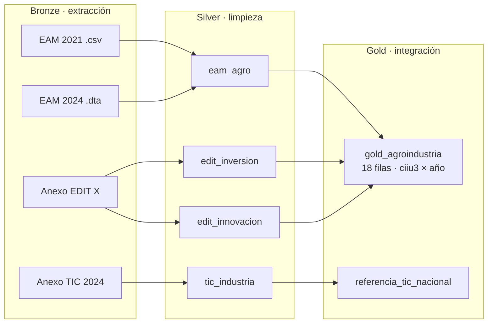

# Pipeline ETL: digitalización y productividad de la agroindustria colombiana

Pipeline ETL en Python que integra tres fuentes oficiales del DANE para medir la innovación, la inversión tecnológica y la productividad de la agroindustria colombiana por subsector.

**Universidad Autónoma de Occidente** · Facultad de Ingeniería y Ciencias Básicas · Especialización en Analítica de Big Data
**Autor:** Edward Andrés Orozco Campo

---

## Problema

No existe una base integrada y comparable que permita medir la digitalización, la innovación y la productividad de la agroindustria colombiana por subsector y periodo. La información está dispersa en encuestas del DANE con formatos, niveles de agregación y periodos distintos.

**Pregunta ETL:** ¿cómo se relaciona el nivel de innovación e inversión tecnológica de cada subsector agroindustrial con su productividad laboral (valor agregado por persona ocupada)?

**Unidad de análisis:** grupo CIIU Rev. 4 A.C. de 3 dígitos × año. Llave de integración: `ciiu3`.

Subsectores analizados (grupos 101 a 109): cárnicos, frutas y hortalizas, aceites y grasas, lácteos, molinería, café, azúcar y panela, otros productos alimenticios y alimentos para animales.

---

## Fuentes de datos

| Fuente | Archivo | Nivel | Periodo |
| --- | --- | --- | --- |
| [Encuesta Anual Manufacturera (EAM) 2024](https://microdatos.dane.gov.co/index.php/catalog/888) | `EAM_ANONIMIZADA_2024.dta` | Establecimiento, CIIU 4 dígitos | 2024 |
| [Encuesta Anual Manufacturera (EAM) 2021](https://microdatos.dane.gov.co/index.php/catalog/802) | `EAM_ANONIMIZADA_2021.csv` | Establecimiento, CIIU 4 dígitos | 2021 |
| [Encuesta de Desarrollo e Innovación Tecnológica (EDIT X)](https://www.dane.gov.co/index.php/estadisticas-por-tema/tecnologia-e-innovacion/encuesta-de-desarrollo-e-innovacion-tecnologica-edit) | `anexo_EDIT_Manufacturera_2019_2020.xlsx` | Grupo CIIU 3 dígitos | 2019–2020 |
| [Indicadores básicos de TIC en Empresas](https://www.dane.gov.co/index.php/estadisticas-por-tema/tecnologia-e-innovacion/tecnologias-de-la-informacion-y-las-comunicaciones-tic/indicadores-basicos-de-tic-en-empresas/indicadores-basicos-de-tic-en-empresas-historicos) | `anex-TIC-Empresas-2024.xlsx` | Total nacional (referencia) | 2024 |

---

## Arquitectura

El pipeline sigue la arquitectura medallón:



- **Bronze:** lee las fuentes sin modificarlas. Cada extracción tiene manejo de errores y queda registrada en el log.
- **Silver:** convierte tipos, homologa CIIU de 4 a 3 dígitos, filtra la agroindustria, renombra columnas y marca problemas de calidad. Guarda en Parquet.
- **Gold:** agrega la EAM por grupo CIIU × año, calcula los indicadores de la EDIT y el índice de digitalización, hace el JOIN por `ciiu3` y valida el resultado. Guarda en Parquet y CSV.

---

## Estructura del proyecto

```
├── config/config.yaml        # rutas, fuentes y constantes
├── data/
│   ├── bronze/               # datos crudos (eam/, edit/, tic_empresas/)
│   ├── silver/               # tablas limpias en Parquet
│   └── gold/                 # tabla integrada en Parquet y CSV
├── logs/logs.txt             # registro de cada ejecución
├── notebooks/eda.ipynb       # análisis exploratorio
├── src/
│   ├── extract/              # extract_eam.py, extract_excel.py
│   ├── transform/            # clean_eam.py, clean_anexos.py, gold_data.py
│   └── load/                 # save_files.py
├── main.py                   # orquesta todo el pipeline
└── requirements.txt
```

---

## Cómo ejecutarlo

Requisitos: Python 3.10 o superior.

```bash
# 1. Clonar el repositorio
git clone https://github.com/Edward-Orozco/Proyecto_ETL_Agroindustria.git
cd Proyecto_ETL_Agroindustria

# 2. Crear y activar el entorno virtual
python -m venv venv
venv\Scripts\activate          # Windows
# source venv/bin/activate     # Linux / Mac

# 3. Instalar dependencias
pip install -r requirements.txt

# 4. Ejecutar el pipeline
python main.py
```

Los datos crudos ya están incluidos en `data/bronze/`. El resultado queda en `data/gold/` y el detalle de la ejecución en `logs/logs.txt`.

---

## Índice de digitalización e innovación

| Elemento | Definición |
| --- | --- |
| Variables | % de empresas innovadoras · % de empresas que invierten en actividades científicas, tecnológicas y de innovación (ACTI) · inversión TIC por empresa |
| Normalización | Min-max entre los 9 grupos: (x − mín) / (máx − mín) |
| Ponderaciones | Iguales: 1/3 cada variable |
| Escala | 0 a 100 |
| Interpretación | Relativa: 100 = grupo con mejor desempeño, 0 = grupo con menor desempeño |

---

## Resultados

**Validación del pipeline (última ejecución):**

| Indicador | Resultado |
| --- | --- |
| Fuentes extraídas sin error | 5 de 5 |
| Grupos con llave compatible entre EAM y EDIT | 9 de 9 (100 %) |
| Celdas nulas en la tabla gold | 0 |
| Duplicados de la llave `ciiu3` × año | 0 |
| Establecimientos sin personal ocupado (excluidos de productividad) | 195 |

**Hallazgos principales:**

- **Aceites y grasas (103)** tiene el índice más alto (78,2), impulsado por su inversión en TIC por empresa.
- **Café (106)** y **azúcar y panela (107)** tienen los índices más bajos (2,6 y 2,8). Azúcar y panela reportó cero inversión en TIC en 2019–2020.
- Un mayor índice no implica mayor productividad: el café tiene el índice más bajo y la productividad más alta en 2024.

---

## Limitaciones

- La EDIT corresponde a 2019–2020 y la EAM a 2021 y 2024; la EDIT se usa como línea base tecnológica.
- La productividad está en pesos corrientes, sin ajustar por inflación.
- El nivel de 3 dígitos no permite separar clases como panela (1072) y azúcar (1071).
- El anexo TIC de industria solo trae el total nacional, por eso se usa como referencia y no entra al JOIN.

---

## Herramientas

Python · pandas · numpy · PyYAML · openpyxl · pyarrow (Parquet) · matplotlib · Jupyter
